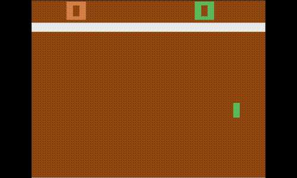

# Pong DQN Reinforcement Learning

A Deep Q-Network (DQN) implementation using PyTorch to solve the Atari Pong environment (`ALE/Pong-v5`) from Gymnasium.

## Demo



## Features
- **Double DQN**: Uses a Deep Q-Network with a target network and Double DQN action selection for stability.
- **Experience Replay**: Implements a replay buffer to break correlation between consecutive transitions.
- **Soft Updates**: Gradually updates the target network parameters to improve training convergence.
- **Preprocessing**: Grayscale conversion, resizing (84x84), frame stacking (4 frames), and frameskip (4 frames per action).
- **Frame Stacking**: Stacks 4 consecutive frames as input channels so the network can infer ball velocity and direction.
- **CNN Architecture**: A 3-layer Convolutional Neural Network followed by 2 Fully Connected layers.
- **Parallel Environments**: 16 parallel `AsyncVectorEnv` workers for faster data collection.
- **torch.compile**: Models compiled with PyTorch 2.0+ `reduce-overhead` mode for faster training.
- **Linear Epsilon Decay**: Epsilon decays linearly per step over a configurable number of steps.
- **Logging**: Integration with TensorBoard for monitoring training metrics like score, loss, and epsilon decay.

## Project Structure
```text
.
├── models/             # Saved model weights (.pt files)
├── runs/               # TensorBoard logs
├── src/
│   ├── agent.py        # Core Agent class (train/test loops, memory management)
│   ├── buffer.py       # Replay Buffer implementation
│   ├── model.py        # CNN and MLP architecture
│   ├── test.py         # Script to run and visualize a trained agent
│   └── train.py        # Script to start the training process
├── requirements.txt    # Project dependencies
└── README.md           # Project documentation
```

## Installation

1. **Clone the repository**:
   ```bash
   git clone <repository-url>
   cd pong
   ```

2. **Create and activate a virtual environment**:
   ```bash
   python -m venv venv
   source venv/bin/activate  # On Windows use `venv\Scripts\activate`
   ```

3. **Install dependencies**:
   ```bash
   pip install -r requirements.txt
   ```

## Usage

### Training
To start training the agent, run:
```bash
python src/train.py
```
Training progress is saved to the `runs/` directory and model weights are saved to `models/latest.pt` every 1000 episodes.

### Testing
To watch a trained agent play (requires `models/latest.pt`):
```bash
python src/test.py
```
This will open a window showing the agent playing the game in real-time (`render_mode="human"`).

### Monitoring Progress
You can visualize training metrics using TensorBoard:
```bash
tensorboard --logdir runs
```

## Hyperparameters
Key hyperparameters are defined at the top of `src/train.py` and `src/test.py`:
- `hidden_layer`: 512 (FC layers)
- `learning_rate`: 0.00025
- `gamma`: 0.99 (Discount factor)
- `batch_size`: 512
- `epsilon_decay_steps`: 2000000 (Linear decay from 1.0 to min_epsilon over this many agent steps)
- `min_epsilon`: 0.1
- `train_freq`: 4 (Train every 4 env-steps)
- `N_ENVS`: 16 (Number of parallel environments)
- `frameskip`: 4 (ALE frameskip; 4 frames skipped per action)


## Results

Trained for **21,000 episodes** against the ALE built-in AI.

```
==================================================
  EVALUATION SUMMARY  (10000 games)
==================================================
  Win rate:         100.00%  (10000 wins)
  Loss rate:          0.00%  (0 losses)
  Draw rate:          0.00%  (0 draws)
  Avg margin:       +19.560  (std 1.196)
  Median margin:    +20.0
  Avg agent score:  21.000
  Avg opp score:    1.440
  Best game:        +21  (21 - 0)
  Worst game:       +14  (21 - 7)
==================================================
```

The agent achieves a **100% win rate** over 10,000 evaluation games, averaging a score of 21–1.4

## Architecture
The Q-Network consists of:
1. **Conv1**: 4 input channels (4 stacked grayscale frames), 32 output channels, 8x8 kernel, stride 4.
2. **Conv2**: 64 output channels, 4x4 kernel, stride 2.
3. **Conv3**: 64 output channels, 3x3 kernel, stride 1.
4. **FC1, FC2**: Linear layers with 512 (default) hidden units and ReLU activation.
5. **Output**: Linear layer mapping to the action space dimensions.
